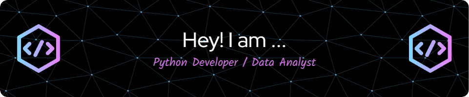

======================================================================================================================================

*   🌍  I'm based in Colombia
*   ✉️  You can contact me at [lic.eduardom89@gmail.com](mailto:lic.eduardom89@gmail.com)

💻 About Me
I am an IT professional with over 3 years of experience in the tech industry. My expertise lies in data analysis using tools like Python, SQL, PostgreSQL, and MySQL. I have a solid understanding of the Microsoft Office suite, enabling efficient reporting and documentation.

🌐 Web Development
I am skilled in building web applications with Django and creating RESTful APIs using FastAPI. I am passionate about developing efficient and scalable backend systems.

🚀 I’m always looking to learn, grow, and contribute to exciting projects.

Feel free to connect or explore my work!
  

